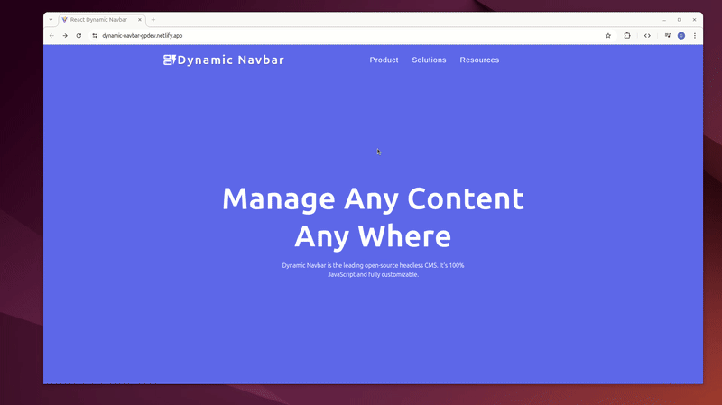
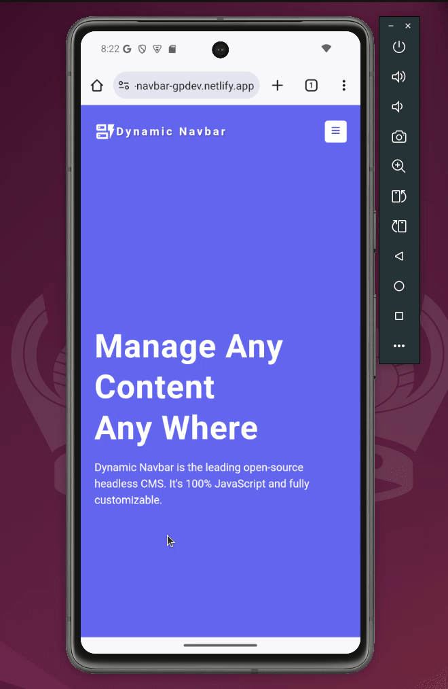

# React Dynamic Navbar ⚡🧭


A modern, responsive navigation bar with dynamic submenus, built with React and Context API. Features smooth 3D animations, mobile-first responsive design, and inspired by Strapi CMS admin panel. Perfect for practicing React hooks, global state management, and advanced UI interactions.

## 🚀 Live Demo

**View Live on Netlify:**  
[React Dynamic Navbar Demo](https://dynamic-navbar-gpdev.netlify.app/)

## 📸 Project Preview

<table align="center">
  <tr>
    <td align="center"><strong>💻 Desktop View with Submenus</strong></td>
  </tr>
  <tr>
    <td align="center"></td>
  </tr>
  
  <tr>
    <td align="center"><strong>📱 Mobile View with Sidebar</strong></td>
  </tr>
  <tr>
    <td align="center"></td>
  </tr>
  <tr>
    <td align="center"><em>Responsive design with mobile sidebar and desktop submenus</em></td>
  </tr>
</table>

## 🎨 Inspiration & Design

- **Design Inspiration:** UI patterns inspired by Strapi headless CMS admin panel
- **Figma Design:** Original design provided by course instructor [View Figma Design](https://www.figma.com/file/rXeU2gYTyKL2FrYmUNgv4r/Strapi-Submenus?node-id=0%3A1&t=Nx5H36ryj9ArZCI6-1)
- **Custom Implementation:** Built from scratch with custom React implementation and rebranded as "Dynamic Navbar"
- **Responsive Behavior:** Mobile sidebar toggle and desktop hover submenus

## ✨ Features

- **Dynamic Submenus** -Smooth 3D flip animations on desktop hover
- **Mobile-First Sidebar** -Full-screen navigation for mobile devices
- **Global State Management**-Context API for shared state across components
- **Responsive Design** -Seamless transition between mobile and desktop views
- **Precise Mouse Tracking** -Advanced boundary detection for submenu dismissal
- **Responsive Typography** -Fluid text scaling with CSS clamp() for optimal readability
- **Customizable Data Structure** -Easy to modify menu items and structure

## 🛠️ Built With

| Tool / Library     | Purpose                          |
| ------------------ | -------------------------------- |
| ⚡ **Vite**        | Fast build tool & dev server     |
| ⚛️ **React 19**    | Component-based UI               |
| 🎯 **Context API** | Global state management          |
| 📋 **React Icons** | Icon library for menu items      |
| 🔑 **Nanoid**      | Unique ID generation             |
| 🎨 **CSS3**        | 3D transforms, transitions, Grid |

## 🎓 Key Learning Outcomes

### Advanced State Management

- **Context API Implementation** for global state sharing
- **Complex State Logic** managing sidebar, submenus, and active states
- **Custom Hook Creation** (`useGlobalContext`) with error handling

### UI/UX & Animations

- **3D Transformations** with CSS perspective and rotateX
- **Smooth Transitions** for sidebar and submenu animations
- **Responsive Breakpoints** with mobile-first approach
- **Precise Mouse Event Handling** with bounding client rect

### Component Architecture

- **Modular Component Structure** with clear separation of concerns
- **Dynamic Data Rendering** from external data source
- **Conditional Rendering** based on screen size and state
- **Event Delegation Patterns** for efficient event handling

### Performance & UX

- **Optional Chaining** for safe data access
- **Dynamic Grid Layouts** based on content length
- **Z-index Management** for proper layer stacking
- **Accessibility Considerations** with semantic HTML

## 🏗️ Component Architecture

```text
src/
├── components/
│ ├── Navbar.jsx # Main navigation with logo and toggle
│ ├── NavLinks.jsx # Desktop navigation links
│ ├── Sidebar.jsx # Mobile sidebar navigation
│ ├── Submenu.jsx # Desktop dropdown submenus
│ └── Hero.jsx # Main content section
├── contexts/
│ ├── AppContext.js # React context creation
│ └── AppProvider.jsx # Global state provider
├── hooks/
│ └── useGlobalContext.js # Custom context hook
└── data.jsx # Menu structure and content
```

## 🚀 Getting Started

### Prerequisites

- **Node.js** ≥ 18.0.0
- **npm** or **yarn** package manager

### Installation

1. Clone the repository

```bash
git clone https://github.com/pro804/React-Dynamic-Navbar.git
```

2. Navigate to the project directory

```bash
cd React-Dynamic-Navbar
```

3. Install dependencies

```bash
npm install
```

4. Start the development server

```bash
npm run dev
```

5. Open http://localhost:5173 to view it in the browser.

## 🔧 Available Scripts

- `npm run dev` — Runs the development server (Vite)
- `npm run build` — Builds the app for production
- `npm run preview` — Previews the production build locally

## 📄 License

This project was created for educational purposes as part of a React learning journey.
This project is licensed under the MIT License.
See the [LICENSE](LICENSE) file for details.
